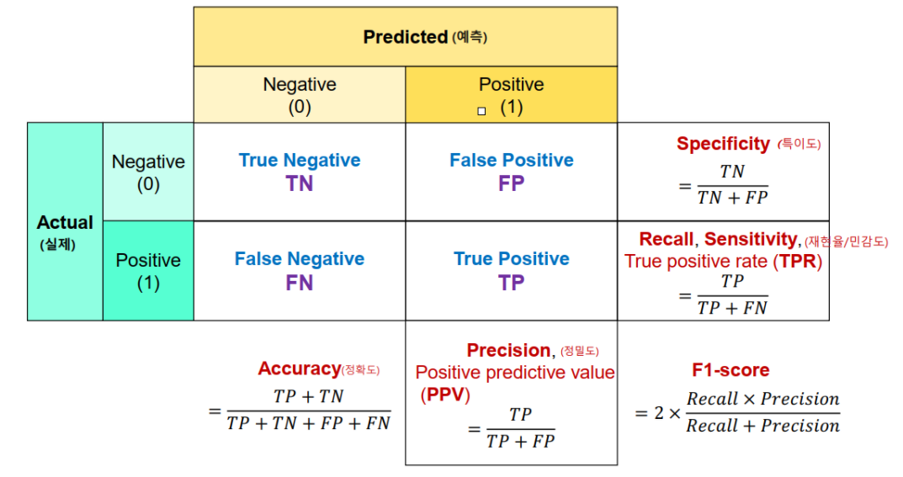
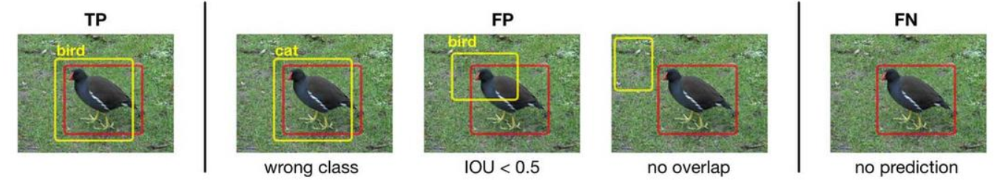
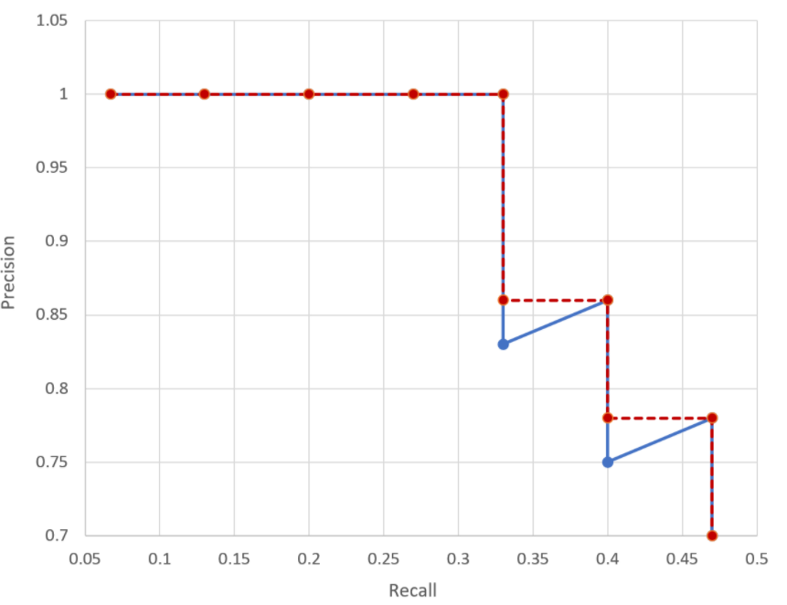

26년 6월 16일 학습 기록

# 컴퓨터 비전(CV)
## ex02_YOLO 객체 탐지

### 1. 객체 탐지 데이터 세트
정확한 객체 탐지 모델 학습을 위해서는 포괄적인 데이터세트가 필요하며 Ultralytics YOLO 모델과 호환되는 형식의 데이터 세트와 구조, 사용법 등을 확인해야함!
``` python
# 내가 이해하기 편하게 정리
객체 탐지 모델을 정확하게 학습시키기 위해서는 다양한 상황과 객체가 포함된 충분한 이미지 데이터와, 각 객체의 위치를 표시한 라벨 데이터가 필요하다. Ultralytics YOLO 모델을 사용할 경우에는 YOLO가 데이터세트를 올바르게 읽을 수 있도록 폴더 구조, 라벨 형식, 클래스 정보, data.yaml 설정 파일 등 YOLO 형식에 맞는 데이터세트 구성 방법을 확인해야 한다.
```

#### YOLO 데이터 세트 가이드
- **1. 정규화된 좌표계**
    - 정규화(Normalized): 서로 다른 기준이나 범위를 가진 값들을 공통된 범위, 주로 0~1 사이의 값으로 바꾸는 과정이며, 상대적인 크기는 유지하되 단위나 스케일을 통일하는 역할을 함
    - YOLO는 객체의 위치를 픽셀 좌표 그대로 사용하지 않고, **이미지 전체의 너비와 높이를 기준으로 0~1 사이의 값으로 정규화하여 표현**함
    - => 이미지의 크기나 비율이 달라져도 객체의 상대적인 위치 정보는 변하지 않아 모델 학습에 더욱 유리함
        - 위 내용에서 이미지 자체를 찌그러뜨리거나 비율을 강제로 변경할 시에 객체 모양/위치 해석이 달라질 수 있기에 **이미지 크기가 달라도 객체의 위치와 크기를 이미지 전체에 대한 상대값으로 표현할 수 있어 모델 학습에 유리함**이라고 이해하면 좋음
    
    - 예시) 이미지 높이 800px, 박스 높이 400px, 정규화된 박스의 높이는 0.5(400/800)이 됨

- **2. 바운딩 박스(Bounding Box)**
    - 바운딩 박스란 이미지 속 객체의 위치를 사각형의 박스로 표현한 것
    - YOLO 형식에서는 이미지 파일처럼 왼쪽 위 좌표가 아닌, 박스의 중심점 좌표를 기준으로 표현함
    - 라벨에는 박스 중심점(x,y) 좌표와 박스의 너비(width), 박스의 높이(height)가 저장됨
    - 예를 들어 이미지 폭이 1000px이고 박스 중심 x좌표가 500px이라면, 정규화된 x 중심 좌표는 500/1000 = 0.5가 됨

- **3. 라벨 파일(.txt)**
    - 각 이미지 파일과 같은 이름의 텍스트 파일에 라벨 정보(이미지 속 객체  하나당 한 줄의 데이터)가 저장됨
    - **class_index x_center y_center width height**
    - 클래스 번호는 0부터 시작함(0-indexed)
    - 모든 좌표값은 0~1 사이로 정규화된 값이어야 함

### 2. 실습) 동물 객체 탐지 모델 만들기
### Roboflow 활용 라벨링 실시
- **Roboflow**: 이미지와 비디오에서 객체 감지, 분류, 세그멘테이션 등과 같은 컴퓨터 비전 작업을 수행할 수 있는 플랫폼

| 작업                      | 의미                      | 결과                 |
| ----------------------- | ----------------------- | ------------------ |
| 분류(Classification)      | 이미지에 무엇이 있는지 판단         | “고양이”              |
| 객체 탐지(Object Detection) | 객체가 어디 있는지 네모 박스로 찾음    | 고양이 위치를 사각형 박스로 표시 |
| 세그멘테이션(Segmentation)    | 객체의 실제 윤곽/영역을 픽셀 단위로 구분 | 고양이 모양 그대로 영역 표시   |

    - **객체 탐지보다 세그멘테이션이 더 정밀하지만, 라벨링 작업도 더 오래 걸리고 학습 난이도도 높음**
- 데이터를 업로드 하고 라벨링 한 후, 다양한 형식으로 데이터를 다운로드할 수 있음
```
라벨링: 이미지 속 객체에 정답 정보를 붙이는 작업, YOLO에서는 객체 하나의 라벨이 'class_index x_center y_center width height' 형식으로 저장됨
```
- Roboflow에서는 특히 YOLO와 같은 객체 탐지 모델을 훈련 시키기 위한 데이터 세트를 준비하는 데 유용함

### 객체 탐지 평가 지표 이해
**IoU(Intersection over Union)**
- 객체 탐지(또는 이미지 분할)에서 **모델이 예측한 바운딩 박스와 실제 정답(Ground-truth) 바운딩 박스가 얼마나 일치**하는지 평가하는 지표
- 겹치는 부분(Intersection)과 두 박스가 차지하는 전체 면적(Union)의 비율을 계산
```
Intersection over Union = Area of Overlap / Area of Union
즉, 교집합 영역 넓이 / 합집합 영역 넓이로 볼 수 있음
```
- **객체 탐지 성능 평가에서의 활용**
    - 일반적으로 IoU 임계값(Threshold)를 0.5로 설정하여, 그 이상이면 정탐(True Positive)으로 간주하는 방식으로 mAP와 같은 모델 성능 계산
    - IoU가 높을수록 객체의 위치를 더 정확하게 탐지했다고 볼 수 있음
```
mAP(mean Average Precision)는 객체 탐지 모델의 성능 평가 지표로, 각 클래스별 탐지 정확도(AP)를 평균낸 값임, 객체를 올바르게 분류했는지뿐만 아니라, 예측한 바운딩 박스가 실제 객체 위치와 얼마나 잘 겹치는지도 함께 반영함
Precision: 정밀도
```
---
#### **mAP 이해를 위한 객체 탐지에서의 정밀도와 재현율 이해**


**Precision(정밀도)** : 모델이 "찾았다(Positive)"고 예측한 것들 중, 실제로 맞는 (진짜 Positive) 비율
- 예: "10개를 예측해서 8개가 진짜였다면 Precision은 80%"

**Recall(재현율)** : 실제로 찾아야 할(Positive) 것 들 중, 모델이 몇 개나 제대로 찾았는지의 비율
- 예: "실제로 10개가 있는데 7개만 찾았다면 Recall은 70%"
---
#### Object Detection에서의 TP, FP, FN


TN(True Negative)은 사용되지 않음
- TN : 배경(객체'새'가 아닌 부분)을 모델이 배경이라고 예측해서 맞힌 경우
- 객체 탐지에선 "배경을 잘 맞히는 것"은 큰 의미가 없어, 주로 TP, FP, FN만을 주요 지표로 삼음


**TP(True Positive)**
- 모델이 "새(bird)"를 찾아야 하는데, 실제로도 새가 있는 위치를 제대로 검출했을 때
- 클래스도 맞고, 위치(바운딩박스)도 적절히 겹치는 비율(IoU)이 기준 이상인 경우

**FP(False Positive)**
- 모델이 "무언가(새)"를 찾았다고 주장했지만, 실제로는 맞지 않은 경우
    - 클래스를 잘못 예측(bird가 아닌데 bird로 판단)
    - 바운딩박스가 실제와 너무 적게 겹치거나(IoU<0.5)
    - 객체가 없는 곳에 박스를 씌움

**FN(False Negative)**
- 실제로 새가 있는데, 모델이 아예 못 찾은 경우 "찾아야 할 객체를 놓친" 상황
---
#### precision(정밀도)과 recall(재현율)의 trade off(반비례관계)
- **Confidence Score** : 모델이 “이 박스 안에 객체가 있다”고 확신하는 정도  
- **Threshold(임계값)** : Confidence Score의 기준값(**임계값 이상이면 객체로 검출, 미만이면 무시**)
---
#### Threshold 설정에 따른 변화

**<U>Threshold를 높이면</U>**  
- 확신이 높은 경우만 남겨두므로 **Precision(정밀도)**가 올라감  
- 확신이 조금이라도 부족한 객체는 배제되므로 **Recall(재현율)**이 떨어짐  

**<U>Threshold를 낮추면</U>**  
- 확신이 조금만 있어도 검출하기 때문에 **Recall(재현율)**이 올라감  
- 잘못된 검출(FP)도 많아져 **Precision(정밀도)**이 떨어짐

즉, **<U>목적</U>**(정확히 맞추는 게 중요 vs 놓치지 않는 게 중요)에 맞춰 적절한 Threshold를 선택
---
####  **AP / mAP / mAP50 (평가지표) 이해하기**


**AP(Average Precision)**  
- Precision-Recall Curve 전체를 평가하기 위해, 여러 점(Threshold별로 달라지는 Precision-Recall 쌍)을 **계단형 곡선**으로 만든 뒤, 그 면적(Area)을 구한 값
- **0~1** 사이 값이며, **1에 가까울수록** 모델이 높은 정밀도와 높은 재현율을 함께 유지한다는 뜻  
- 한 클래스(예: ‘bird’) 기준에서 계산한 값을 AP라고 함  

**mAP(mean Average Precision)**  
- 여러 클래스(예: ‘bird’, ‘cat’, ‘dog’ 등)에 대해 각각 AP를 구한 뒤, 그 평균을 낸 값  
- 객체 탐지 모델의 **종합 성능 지표**로 자주 사용됨

**mAP50**  
- IoU 임계값을 0.5로 두고 계산한 mAP
- 즉, IoU≥0.5면 정탐(True Positive)으로 간주
- 일반적으로 mAP50이 높다는 것은 "박스가 실제 객체와 절반 이상 겹치기만 해도(0.5 이상) 맞춘 것으로 간주했을 때, 모델의 평균 정확도가 얼마나 되는지"를 보여줌

### 실습 결과 성능 해석
#### 1. 성능 확인 (검증 결과)
```text
Validating runs/detect/train2/weights/best.pt...
Ultralytics 8.3.82 🚀 Python-3.11.11 torch-2.5.1+cu124 CUDA:0 (Tesla T4, 15095MiB)
YOLO11n summary (fused): 100 layers, 2,582,542 parameters, 0 gradients, 6.3 GFLOPs
                 Class     Images  Instances      Box(P          R      mAP50  mAP50-95): 100%|██████████| 9/9 [00:06<00:00,  1.37it/s]
                   all        280        746      0.952      0.926       0.97       0.87
             butterfly        147        161      0.979      0.988      0.991      0.962
                 sheep        133        585      0.925      0.864      0.949      0.778
Speed: 0.5ms preprocess, 2.9ms inference, 0.0ms loss, 5.4ms postprocess per image
Results saved to runs/detect/train2
```
- **all**: 전체 클래스(= 종합 성능)  
- **butterfly, sheep**: 각 클래스별 성능  

> ##### 주요 지표
> 1. **Box(P)**: 최종 **Precision(정밀도)**  
> 2. **R**: 최종 **Recall(재현율)**  
> 3. **mAP50**: IoU=0.5 기준에서 산출한 mAP(mean Average Precision)  
> 4. **mAP50-95**: IoU 0.5부터 0.95까지(0.05 간격) 평균을 낸 mAP  
---
#### 2. 지표 해석 방법
| **지표**         | **개념**                                                                                         | **예시**                      |
|:----------------:|:------------------------------------------------------------------------------------------------:|:-----------------------------:|
| **Precision(정밀도)** | 모델이 “검출했다(Positive)”고 예측한 것 중 실제로 맞는(진짜 Positive) 비율                             | 예: 0.952 (≈ 95.2%) <br/> → 대부분의 예측이 정확함 |
| **Recall(재현율)**     | 실제 Positive(찾아야 할 객체) 중, 모델이 놓치지 않고 검출해 낸 비율                                  | 예: 0.926 (≈ 92.6%) <br/> → 실제 객체 대부분을 검출함 |
| **mAP50**        | IoU(겹치는 정도) = 0.5에서 계산한 평균 정밀도(여러 임계값에 대해 산출한 Precision-Recall 곡선의 면적)    | 예: 0.97 (≈ 97%) <br/> → 전반적인 검출 성능이 매우 우수함 |
| **mAP50-95**     | IoU가 0.5부터 0.95까지 변할 때의 평균 정밀도(더 까다로운 조건을 종합적으로 고려한 성능)                | 예: 0.87 (≈ 87%) <br/> → 다양한 조건에서도 우수한 성능을 보임                |

##### 클래스별 성능 예시

- **butterfly**
    - Precision: 0.979
    - Recall: 0.988
    - mAP50: 0.991
    - mAP50-95: 0.962
    - ⇒ 나비 클래스는 매우 높은 정밀도와 재현율을 보이며, 전반적인 검출 성능이 우수함

- **sheep**
    - Precision: 0.925
    - Recall: 0.864
    - mAP50: 0.949
    - mAP50-95: 0.778
    - ⇒ 양 클래스 역시 좋은 성능을 보이나, mAP50-95에서 약간 낮은 성능을 보임

<br>

- 현재 모델 성능
- 전체 (all): 정밀도 95.2%, 재현율 92.6%, mAP50 97%, mAP50-95 87% → 전반적으로 매우 우수한 성능
- butterfly: 거의 완벽에 가까운 검출 성능
- sheep: 높은 성능을 보이나, mAP50-95(87.8%)에서 약간 개선 가능
---
#### 3. 성능개선방법

> 1. **데이터 점검 및 증강**: 라벨 품질, 클래스 불균형, 데이터 다양성 확보  
> 2. **학습 설정 최적화**: 학습률, 에폭, 배치 사이즈, Early Stopping 조건 재조정  
> 3. **모델 구조/크기 조정**: 다른 모델 크기(n, s, m 등) 또는 backbone 변경 시도  
> 4. **후처리 및 추가 튜닝**: Confidence Threshold, NMS(Non-Maximum Suppression) 등 파라미터 최적화 및 TensorBoard 모니터링
