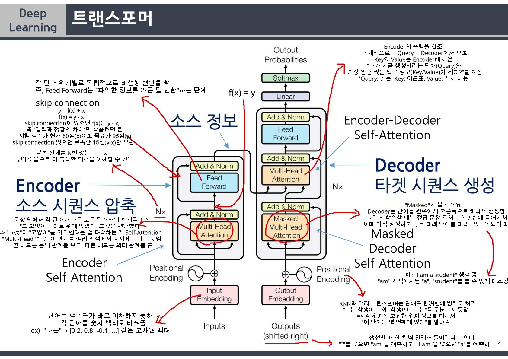

26년 6월 19일 학습 기록

# 자연어 처리
## transformer

### transformer architecture in "Attention is All You Need"

- 보충 설명
    - transformer: <u>**입력 시퀀스를 받아서 출력 시퀀스를 만드는 구조**</u>
        - transformer의 한 줄 흐름:
    > 입력 문장 → 임베딩+위치 → Encoder(Self-Attention으로 문맥 이해) → Decoder(Masked Attention으로 순서대로 생성 + Encoder 출력 참조) → 확률 분포 → 다음 단어 출력

    - Encorder: 입력을 이해하는 쪽
    - Decorder: 출력을 생성하는 쪽

    - Encorder-Decoder Attention:
    **Q(Decoder)**: "지금 내가 만들려는 단어와 관련된 입력 정보가 뭘까?"
    **K(Encorder)**: 
    "나는" -> 나는 주어 관련 정보, "학생" -> 학생 직업/신분 정보, "이다" -> 이다 서술 정보
    Q와 K를 비교해서 점수를 매기고 이 점수대로 V(실제 정보)를 가져옴
    **V(Encorder)**: "학생"의 실제 의미 정보를 가져옴
        - Decorder: **"지금 내가 뭘 만들고 있는지"**를 잘 알고 있으며, # 질문(Q)
        - Encorder: **"입력 문장이 무슨 뜻인지"**를 잘 알고 있음 # 답변(K,V)